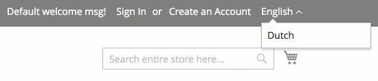
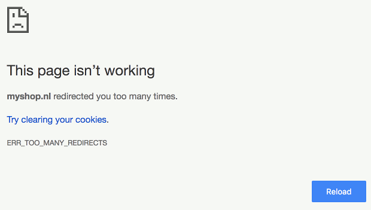

# Multi-Store Fix Module for Magento 2

Fix redirect loops when using multiple storeviews in Magento 2 with `MAGE_RUN_CODE` environment variables combined with the locale switcher.

## Description
Magento 2 has a built-in store switcher (language switcher / locale switcher) that visitors can use to choose their preferred language.

If a language is chosen, the visitor will be redirected to the same page in one of the other store views (languages). The store switcher uses a cookie to remember the selected store code between requests. This makes sense when multiple store views share the same base url, because otherwise the selected store view could not be determined.

It's common for a web shop to have multiple domain names, with each hostname showing a translated version of the same content. When a visitor selects another language, he can simple be redirected to the same page on one of the other domain names: the request hostname is used to determine the selected store view. The [recommended way to set this up](http://devdocs.magento.com/guides/v2.1/config-guide/multi-site/ms_over.html) is by configuring the web server to set the environment variable `MAGE_RUN_TYPE` to `store` and `MAGE_RUN_CODE` to the correct store code depending on the requested hostname.

If a store code is found in both the store switcher cookie *and* the server environment variable, Magento uses the one **from the cookie**. This doesn't make sense. It breaks store switching and can even cause a redirect loop.

### Example
Imagine the following Magento 2 web shop with two store views:

| Base URL           | Store Code | Store Name |
|--------------------|------------|------------|
| http://myshop.com/ | default    | English    |
| http://myshop.nl/  | nl         | Dutch      |

1. Visitor opens `http://myshop.com/`. While processing the request, Magento finds no cookie, but the environment variable is set to `default` so the *English* store view is shown.
2. Visitor selects *Dutch* from the locale switcher.
3. Magento sets the cookie for `myshop.com` to `nl` and redirects the visitor to `http://myshop.nl/`.
4. Visitor's browser requests `http://myshop.nl/`. Magento finds no cookie (as it was set for the other domain), but the environment variable is set to `nl` so the *Dutch* store view is shown. So far, no problems.
5. Now, the visitor tries to switch back to *English* using the locale switcher.
6. Magento sets the cookie for `myshop.nl` to `default` and redirects the visitor to `http://myshop.com/`.
7. Visitor's browser requests `http://myshop.com/`. Magento finds the cookie (from step 3) is set to `nl` and ignores the environment variable. It loads the *Dutch* store view, but because the hostnames do not match it redirects to `http://myshop.nl/`.
8. Visitor's browser requests `http://myshop.nl/`. Magento finds the cookie (from step 6) set to `default` and ignores the environment variable. It loads the *English* store view, but because the hostnames do not match it redirects to `http://myshop.com/`.
9. Steps 7 and 8 will be repeated until the browser gives up and shows a *Too many redirects* error message:

### Solution
This module uses a plugin for Magento's `StoreCookieManager::getStoreCodeFromCookie` method which is responsible for reading the store code from the locale switcher cookie. It gets called by
`StoreResolver::getCurrentStoreId` which looks up the store code in the database and returns its ID.

If a store code is set by the webserver using an environment variable, the plugin will not read the cookie but return the store code as defined by the webserver instead. This way a cookie can never override the environment variable.

The plugin checks to see if `MAGE_RUN_TYPE` is set to `store` *and* `MAGE_RUN_CODE` contains a string value. This way, it will not break other setups. For instance, when `MAGE_RUN_TYPE` is set to `website`, the problem as described above does not occur and there's no need for a fix.

## Installation
The preferred way of installing this module is through [Composer](https://getcomposer.org/). Simply add `metmeer/magento2-multi-store-fix`
as a dependency, and Composer will take care of downloading and extracting the files to the correct locations:

    composer require metmeer/magento2-multi-store-fix

Optionally you can download the latest version of the module [here](https://github.com/METMEER/magento2-multi-store-fix/releases) and copy the archive's contents to your project under directory `app/code/METMEER/MultiStoreFix`.

After the files are installed, the module can be enabled with this command:

    bin/magento module:enable METMEER_MultiStoreFix

Each time a new module is enabled, Magento needs to upgrade the database. This is done with the following command:

    bin/magento setup:upgrade

If the deployment mode is set to *production*, the dependency injection compiler needs to be run. This is not necessary for the *developer* mode. To start the compiler, use this command:

    bin/magento setup:di:compile

At last, the caches should be cleared with this command:

    bin/magento cache:flush

## Configuration
No further configuration is required. The fix is applied automatically when needed.

## Contribution
Feel free to contribute to this module by reporting issues or creating pull requests for improvements.

## License
This project is licensed under the MIT License - see the [LICENSE](LICENSE) file for details.

## Copyright
Copyright (c) 2017 [METMEER](https://www.metmeer.nl/) - All rights reserved.
